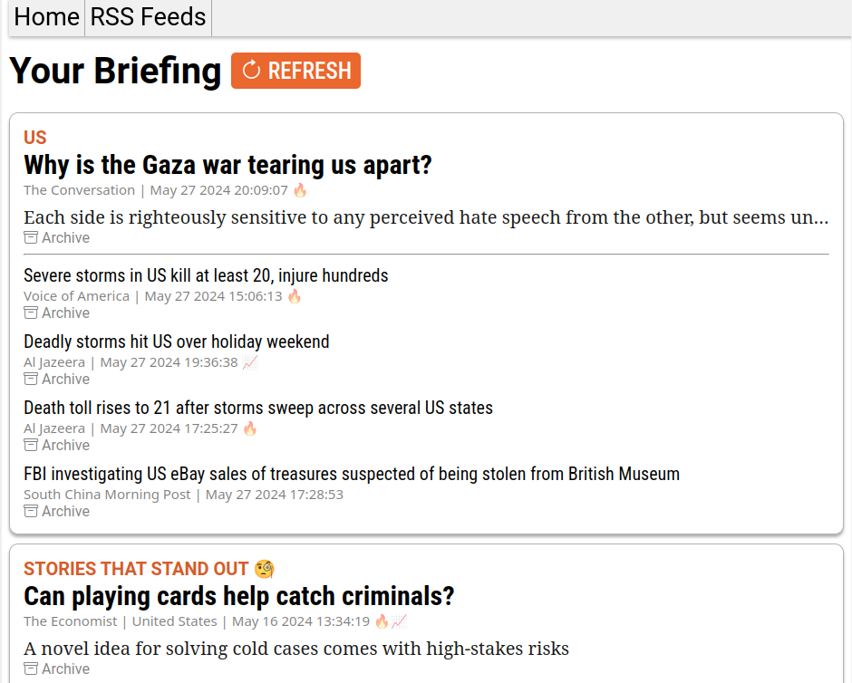
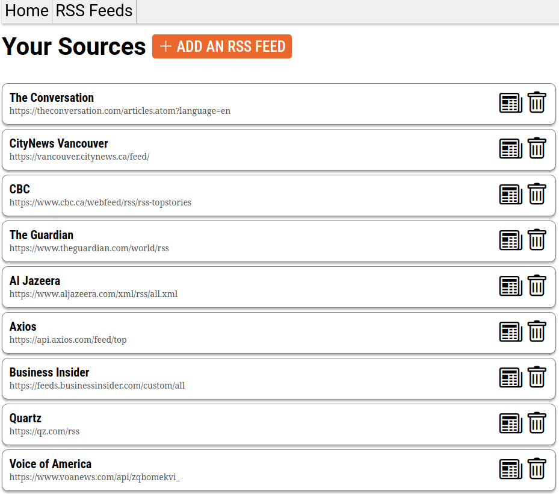

# A smart RSS reader that curates stories for you
Traditional RSS readers show the user a chronological list of stories from the sources that the user has added. While the user has some tools at their disposal to find interesting stories—such as by placing their news sources into categories—it can still be hard to see at a glance which stories are interesting or important. 

This RSS reader ranks and categorizes stories for the user to make it easier to find interesting and important stories. It groups stories together using common keywords, while also ranking stories based on their recency as well as sentiment analysis of their titles and summaries. 

On the assumption that stories with negative sentiments are more likely to be important (e.g. natural disasters), this program gives them a boost in the rankings. For balance, it also creates a dedicated "STORIES THAT STAND OUT 🧐" section and places it in second place on the homepage to boost stories with positive sentiments.

## Technical details

The frontend is made using **vue** and **node.js**. The backend is made using **python** with APIs handled using **flask**.

**NTLK** is used to perform text parsing and analysis functionality. It is used to remove stopwords and find word stems in order to make it easier to identify common keywords for categorization purposes. It is also used for sentiment analysis using the VADER lexicon.

## How to run it
To run this web application, you must run launch the backend and frontend.
Install the dependencies for the backend from `requirements.txt` using pip, and then run it using `flask --app Server.py run`.
Run `npm install` and then `npm run dev` from the `Frontend/RSSReader` folder to launch the frontend.

## What it looks like
Once you have added your preferred sources, the program will be able to generate a "briefing" that contains stories grouped together using keywords, like this:

Use the "RSS Feeds" page to add sources, remove sources, or view stories retrieved from a specific source:

